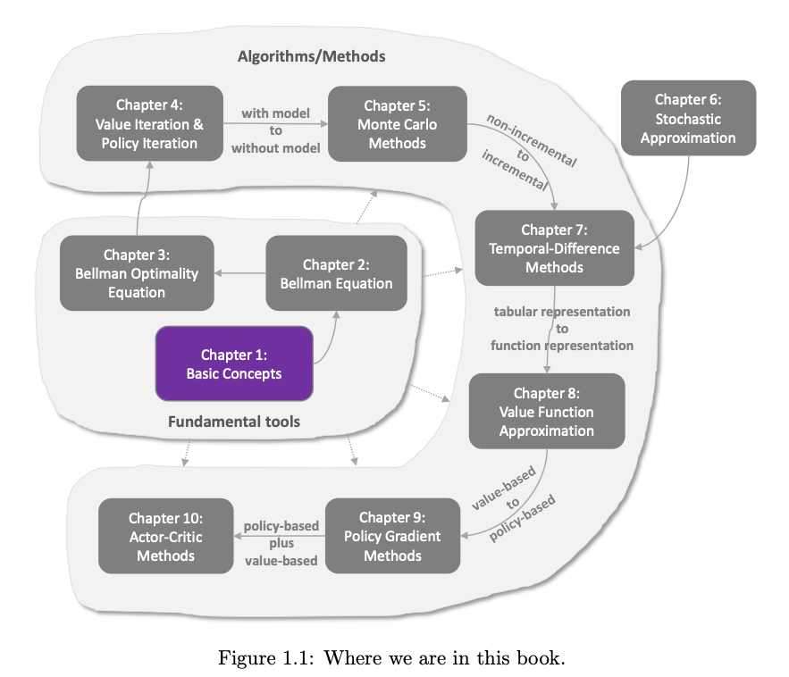
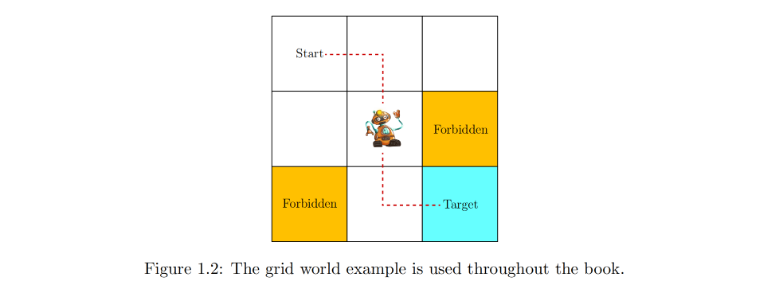
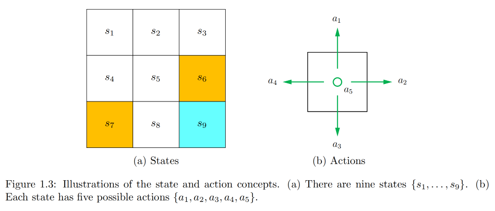
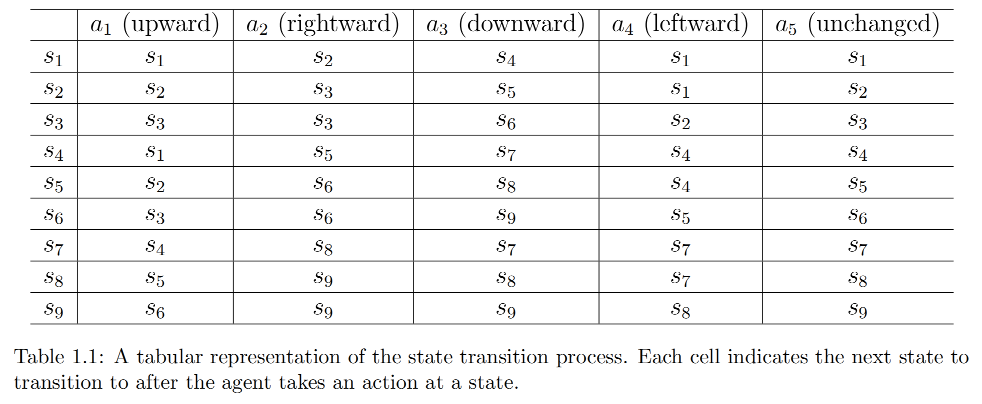
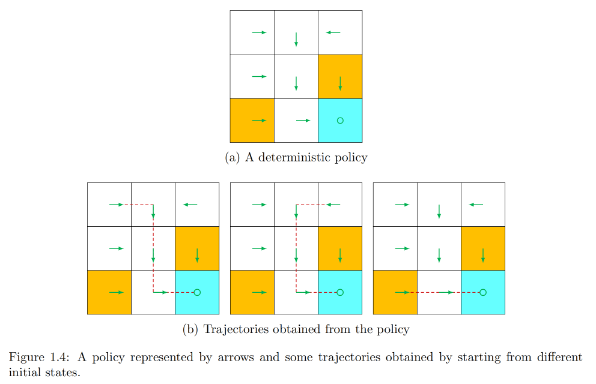
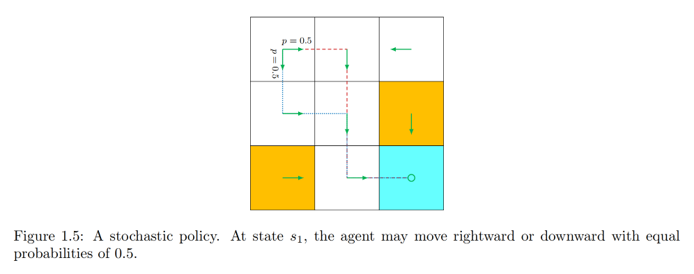
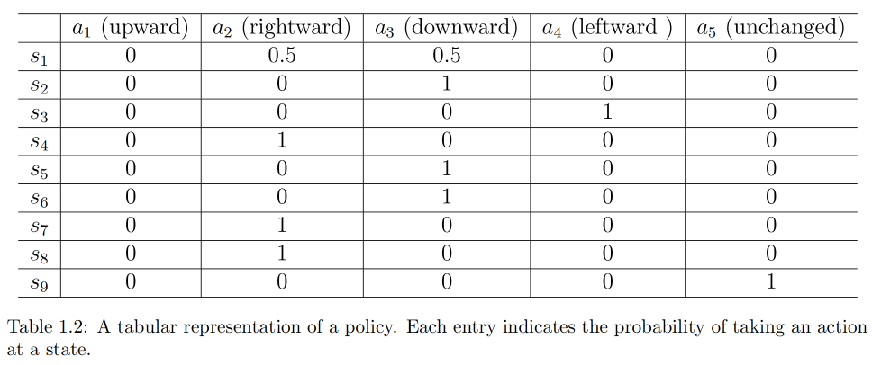
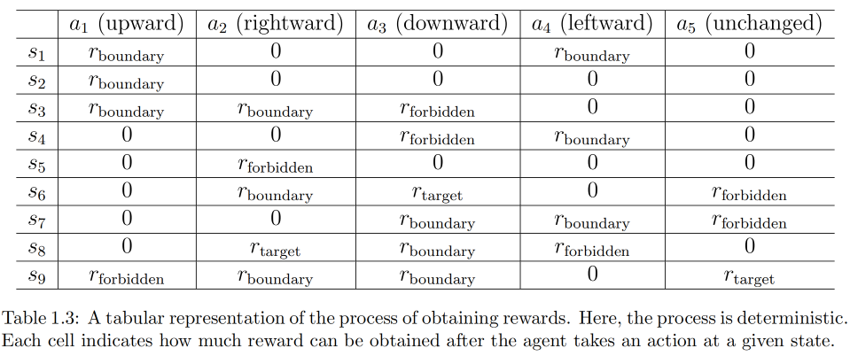
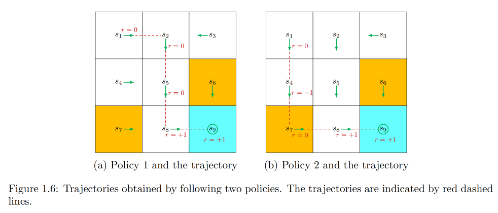

# 第一章：基本概念

本章介绍强化学习的基本概念，这些概念将在全书广泛使用。我们先通过示例直观呈现这些概念，再基于马尔可夫决策过程框架对其进行形式化定义。

# 1 网格世界示例

考虑如图1.2所示的示例：一个机器人在网格世界中移动。这个机器人（称为智能体）可以在网格中相邻单元格间移动，每个时间步只能占据一个单元格。白色单元格是可进入的，橙色单元格是禁止进入的，网格中还有一个机器人需要到达的目标单元格。本书将始终使用这类网格世界示例，因为它们直观易懂，便于阐释新概念和算法。

智能体的终极目标是找到一个“优良”的策略，使得它从任意初始单元格出发，都能到达目标单元格。如何定义“优良”呢？核心思路是：智能体应能避开禁止单元格、不绕不必要的远路、不碰撞网格边界。

如果智能体事先知道网格世界的地图，规划一条到达目标的路径会非常简单；但如果智能体事先对环境毫无了解，它就必须通过试错与环境交互，才能找到优良策略。要实现这一点，本章后续介绍的概念必不可少。

# 2 状态与动作

## 2.1 状态

首先要介绍的概念是**状态**，它描述了智能体相对于环境的状态。在上述网格世界示例中，状态对应智能体的位置。由于网格有9个单元格，因此共有9个状态，记为 $ s_1,~s_2,~...,~s_9 $（如图1.3(a)所示）。所有状态的集合称为**状态空间**，记为 $ S = \{ s_1, ..., s_9 \} $。

## 2.2 动作

对于每个状态，智能体可以执行5种可能的动作：向上、向右、向下、向左、保持不动，分别记为 $ a_1,~a_2,~a_3,~a_4,~a_5 $（如图1.3(b)所示）。所有动作的集合称为**动作空间**，记为 $ A = \{ a_1, ..., a_5 \} $。

不同状态可以有不同的动作空间。例如，在状态 $ s_1 $（网格左上角）执行 $ a_1 $（向上）或 $ a_4 $（向左）会碰撞网格边界，因此可将 $ s_1 $ 的动作空间设为 $ A(s_1) = \{ a_2, a_3, a_5 \} $。本书考虑最一般的情况：所有状态的动作空间均为 $ A $，即 $ A(s_i) = A = \{ a_1, ..., a_5 \} $（对所有 $ i $）。

# 3 状态转移

当智能体执行一个动作时，可能会从一个状态转移到另一个状态，这个过程称为**状态转移**。例如，若智能体在状态 $ s_1 $ 选择动作 $ a_2 $（向右），就会转移到状态 $ s_2 $，这个过程可表示为： &#x20;

$$
s_1 \stackrel{a_2}{\to} s_2
$$

我们接下来分析两个重要示例，理解特殊场景下的状态转移：

1. **尝试超出网格边界的情况**：例如在状态 $ s_1 $ 执行动作 $ a_1 $（向上），智能体无法超出状态空间，因此会反弹回原状态，即： &#x20;

   $$
   s_1 \stackrel{a_1}{\to} s_1
   $$
2. **尝试进入禁止单元格的情况**：例如在状态 $ s_5 $ 执行动作 $ a_2 $（向右），可能遇到两种场景：
   - 场景1：禁止单元格 $ s_6 $ 仍可进入，此时下一状态为 $ s_6 $，转移过程为 $ s_5 \stackrel{a_2}{\to} s_6 $；
   - 场景2：禁止单元格 $ s_6 $ 不可进入（如被墙壁包围），此时智能体反弹回 $ s_5 $，转移过程为 $ s_5 \stackrel{a_2}{\to} s_5 $。

哪种场景更合理？答案取决于实际环境。本书采用第一种场景（禁止单元格可进入，但进入会受到惩罚），因为这种场景更具一般性和研究价值。此外，由于我们考虑的是模拟任务，可自主定义状态转移过程；而在真实场景中，状态转移过程由实际动态规律决定。

## 3.1 状态转移的表格表示

状态转移过程可通过表格描述，如表1.1所示。表格的每一行对应一个状态，每一列对应一个动作，单元格内的内容表示智能体在对应状态执行对应动作后转移到的下一状态。

## 3.2 状态转移的数学描述

从数学角度，状态转移过程可通过条件概率描述。例如，对于状态 $ s_1 $ 和动作 $ a_2 $，条件概率分布为： $ p(s_1~|~s_1,~a_2) = 0,~\quad~p(s_2~|~s_1,~a_2) = 1,~\quad~p(s_3~|~s_1,~a_2) = 0,~\quad~p(s_4~|~s_1,~a_2) = 0,~\quad~p(s_5~|~s_1,~a_2) = 0~ $。

这表示在 $ s_1 $ 执行 $ a_2 $ 时，转移到 $ s_2 $ 的概率为1，转移到其他状态的概率为0，即该转移是确定性的。

需要注意的是，表格表示仅适用于确定性状态转移；对于一般的随机状态转移，必须通过条件概率分布描述。例如，若网格中有随机阵风，在 $ s_1 $ 执行 $ a_2 $ 时，智能体可能被吹到 $ s_5 $ 而非 $ s_2 $，此时 $ p(s_5~|~s_1,~a_2) > 0 $。但为简化，本书网格世界示例均采用确定性状态转移。

# 4 策略

策略告诉智能体在每个状态下应执行哪些动作。直观上，策略可用箭头表示（如图1.4(a)）；遵循某个策略，智能体从初始状态出发可生成一条轨迹（如图1.4(b)）。

## 4.1 策略的数学描述

从数学角度，策略通过条件概率描述。记图1.4中的策略为 $ \pi(a~|~s) $，它是定义在每个状态上的条件概率分布。例如，状态 $ s_1 $ 的策略为：

$$
\pi(a_1 \mid s_1) = 0, \\
\pi(a_2 \mid s_1) = 1, \\
\pi(a_3 \mid s_1) = 0, \\
\pi(a_4 \mid s_1) = 0, \\
\pi(a_5 \mid s_1) = 0;
$$

这表示在 $ s_1 $ 执行 $ a_2 $ 的概率为1，执行其他动作的概率为0，即该策略是确定性的。

策略也可以是随机的。例如，图1.5中的随机策略：在 $ s_1 $，智能体以相同概率（均为0.5）选择向右（ $ a_2 $ ）或向下（ $ a_3 $ ），此时 $ s_1 $ 的策略为：

$$
\pi(a_1 \mid s_1) = 0, \\
\pi(a_2 \mid s_1) = 0.5, \\
\pi(a_3 \mid s_1) = 0.5, \\
\pi(a_4 \mid s_1) = 0, \\
\pi(a_5 \mid s_1) = 0.
$$

## 4.2 策略的表格表示

通过条件概率表示的策略可存储为表格，如表1.2所示。表格的第 $ i $ 行第 $ j $ 列表示在第 $ i $ 个状态执行第 $ j $ 个动作的概率，这种表示方式称为**表格表示**。第8章将介绍另一种策略表示方式：参数化函数。

# 5 奖励

奖励是强化学习中最独特的概念之一。智能体在某个状态执行一个动作后，会从环境中获得一个奖励 $ r $ 作为反馈，奖励是状态 $ s $ 和动作 $ a $ 的函数，因此也记为 $ r(s,~a) $。奖励的取值可以是正实数、负实数或零，不同的奖励会对智能体最终学习到的策略产生不同影响：通常用正奖励鼓励智能体执行对应动作，用负奖励阻止智能体执行对应动作。

## 5.1 网格世界中的奖励设计

在网格世界示例中，奖励设计如下：

- 若智能体尝试超出网格边界，奖励为 $ r_{boundary} = -1 $；
- 若智能体尝试进入禁止单元格，奖励为 $ r_{forbidden} = -1 $；
- 若智能体到达目标状态，奖励为 $ r_{target} = +1 $；
- 其他情况（如在可进入单元格间正常移动），奖励为 $ r_{other} = 0 $。

需要特别注意目标状态 $ s_9 $：智能体到达 $ s_9 $ 后，奖励过程不一定终止。例如：

- 若在 $ s_9 $ 执行 $ a_5 $（不动），下一状态仍为 $ s_9 $，奖励为 $ r_{target} = +1 $；
- 若在 $ s_9 $ 执行 $ a_2 $（向右），下一状态仍为 $ s_9 $，但奖励为 $ r_{boundary} = -1 $（因尝试超出边界）。

奖励可视为“人机交互接口”，通过它我们能引导智能体表现出预期行为。例如，上述奖励设计会让智能体倾向于避免超出边界和进入禁止单元格。在强化学习中，设计合适的奖励是重要步骤，但对于复杂任务而言，这一步并不简单——它需要使用者深入理解问题；不过，相比其他需要专业背景的方法，奖励设计仍更简便。

## 5.2 奖励的表格表示

智能体执行动作后获得奖励的过程，可直观地用表格表示，如表1.3所示。表格的每一行对应一个状态，每一列对应一个动作，单元格内的数值表示智能体在对应状态执行对应动作后获得的奖励。

## 5.3 奖励的数学描述

表格表示仅适用于确定性奖励过程；更一般的方式是用条件概率 $ p(r~|~s,~a) $ 描述奖励过程。例如，对于状态 $ s_1 $ 和动作 $ a_1 $，有： &#x20;

$$
p(r = -1 | s_1, a_1) = 1,\quad p(r \neq -1 | s_1, a_1) = 0  
$$

这表示在 $ s_1 $ 执行 $ a_1 $ 时，智能体必然获得 $ r = -1 $ 的奖励。

实际中奖励过程也可以是随机的。例如，学生努力学习（对应“状态-动作”对）可能获得正奖励（如考试高分），但奖励的具体数值可能是不确定的。

# 6 轨迹、回报与回合

## 6.1 轨迹

轨迹是状态-动作-奖励构成的链条。例如，遵循图1.6(a)中的策略，智能体可生成如下轨迹：

$$
\begin{aligned}\\s_{1} & \xrightarrow[r=0]{a_{2}} s_{2} \xrightarrow[r=0]{a_{3}} s_{5} \xrightarrow[r=0]{a_{3}} s_{8} \xrightarrow[r=1]{a_{2}} s_{9}.\\\end{aligned}
$$

## 6.2 回报

轨迹的**回报**定义为沿轨迹收集的所有奖励的总和。例如，上述轨迹的回报为： &#x20;

$$
return = 0 + 0 + 0 + 1 = 1 \tag{1.1}  
$$

回报也称为总奖励或累积奖励。

回报可用于评估策略。例如，通过比较图1.6中两种策略的回报，可判断策略优劣：从 $ s_1 $ 出发，左侧策略的回报为1（如式1.1）；右侧策略生成的轨迹为：

$$
\begin{aligned}\\S_{1} & \xrightarrow[r=0]{a_{3}} S_{4} \xrightarrow[r=-1]{a_{3}} S_{7} \xrightarrow[r=0]{a_{2}} S_{8} \xrightarrow[r=+1]{a_{2}} S_{9}.\\\end{aligned}
$$

对应的回报为： &#x20;

$$
return = 0 - 1 + 0 + 1 = 0 \tag{1.2}
$$

式(1.1)和式(1.2)的结果表明，左侧策略更优（回报更大），这与“右侧策略因经过禁止单元格而更差”的直觉一致。

## 6.3 折扣回报（无限长轨迹）

式(1.1)中的回报针对有限长度轨迹；对于无限长轨迹，直接求和会导致回报发散。例如，若策略让智能体在到达 $ s_9 $ 后保持不动，生成的无限长轨迹为：

$$
\begin{aligned}\\s_{1} & \xrightarrow[r=0]{a_{2}} s_{2} \xrightarrow[r=0]{a_{3}} s_{5} \xrightarrow[r=0]{a_{3}} s_{8} \xrightarrow[r=1]{a_{2}} s_{9} \xrightarrow[r=1]{a_{5}} s_{9} \xrightarrow[r=1]{a_{5}} s_{9} \ldots\\\end{aligned}
$$

直接求和的回报为： &#x20;

$$
return = 0 + 0 + 0 + 1 + 1 + 1 + \cdots = \infty  
$$

为解决这一问题，需引入**折扣回报**概念：折扣回报是折扣后奖励的总和，公式为：

$$
\text{discounted return} = 0 + \gamma~0 + \gamma^2~0 + \gamma^3~1 + \gamma^4~1 + \gamma^5~1 + \ldots, \tag{1.3}
$$

其中 $ \gamma \in (0,1) $ 称为**折扣因子**。当 $ \gamma \in (0,1) $ 时，式(1.3)的结果可计算为： &#x20;

$$
\text{discounted return} = \gamma^3 \left( 1 + \gamma + \gamma^2 + \cdots \right ) = \gamma^3 \cdot \frac{1}{1 - \gamma}
$$

折扣因子的作用：

1. 支持无限长轨迹，无需设置终止准则；
2. 调节对近期和远期奖励的重视程度：
   - 若 $ \gamma $ 接近0，智能体更重视近期奖励，策略会“短视”；
   - 若 $ \gamma $ 接近1，智能体更重视远期奖励，策略会“远视”，愿意承担近期负奖励的风险（详见3.5节）。

## 6.4 回合

在强化学习中，“回合”是一个重要概念：智能体遵循策略与环境交互时，若在某些终端状态停止，形成的轨迹称为**回合**（或试次）。若环境或策略具有随机性，从同一状态出发可能生成不同回合；若环境和策略均为确定性，从同一状态出发始终生成相同回合。

回合通常是有限长度的轨迹，对应这类轨迹的任务称为**回合制任务**；而没有终端状态、交互过程永不终止的任务称为**持续任务**。实际上，可通过将回合制任务转换为持续任务，实现两者的统一数学处理：当智能体到达终端状态后，可通过以下两种方式继续交互：

1. 将终端状态设为**吸收状态**：即智能体到达后永不离开。例如，对目标状态 $ s_9 $，可设置其动作空间为 $ A(s_9) = \{ a_5 \} $，或设置所有动作对应的转移概率 $ p(s_9~|~s_9,~a_i) = 1 $（ $ i=1,...,5 $ ）；
2. 将终端状态视为普通状态：动作空间与其他状态一致，智能体可能离开后再次返回。由于每次到达 $ s_9 $ 可获得正奖励 $ r=1 $，智能体最终会学习到在 $ s_9 $ 停留以收集更多奖励。需注意：若回合无限长且停留奖励为正，必须用折扣回报避免发散。

本书采用第二种场景：目标状态视为普通状态，其动作空间为 $ A(s_9) = \{ a_1, ..., a_5 \} $。

# 7 马尔可夫决策过程

本章前序小节通过示例介绍了强化学习的基本概念，本节将在**马尔可夫决策过程（MDP）** 框架下对这些概念进行形式化定义。MDP是描述随机动态系统的通用框架，其核心要素如下：

## 7.1 集合

- **状态空间**：所有状态的集合，记为 $ S $；
- **动作空间**：每个状态 $ s \in S $ 对应的动作集合，记为 $ A(s) $；
- **奖励集合**：每个状态-动作对 $ (s,~a) $ 对应的奖励集合，记为 $ R(s,~a) $。

## 7.2 模型

- **状态转移概率**：在状态 $ s $ 执行动作 $ a $，转移到状态 $ s' $ 的概率，记为 $ p(s'~|~s,~a) $，满足对任意 $ (s,~a) $，有 $ \sum_{s' \in S} p(s'~|~s,~a) = 1 $；
- **奖励概率**：在状态 $ s $ 执行动作 $ a $，获得奖励 $ r $ 的概率，记为 $ p(r~|~s,~a) $，满足对任意 $ (s,~a) $，有 $ \sum_{r \in R(s,~a)} p(r~|~s,~a) = 1 $。

## 7.3 策略

在状态 $ s $ 选择动作 $ a $ 的概率，记为 $ \pi(a~|~s) $，满足对任意 $ s \in S $，有 $ \sum_{a \in A(s)} \pi(a~|~s) = 1 $。

## 7.4 马尔可夫性

马尔可夫性指随机过程的“无记忆性”，数学表示为：

$$
\begin{aligned}\\p(s_{t+1} \mid s_t, a_t, s_{t-1}, a_{t-1}, \ldots, s_0, a_0) &= p(s_{t+1} \mid s_t, a_t), \\\\p(r_{t+1} \mid s_t, a_t, s_{t-1}, a_{t-1}, \ldots, s_0, a_0) &= p(r_{t+1} \mid s_t, a_t),\\\end{aligned}\tag{1.4}
$$

其中 $ t $ 表示当前时间步， $ t+1 $ 表示下一时间步。式(1.4)表明，下一状态或奖励仅依赖当前状态和动作，与历史状态-动作无关。马尔可夫性是推导MDP核心工具——贝尔曼方程的关键（见第2章）。

## 7.5 补充说明

- **模型稳定性**：本书仅考虑**平稳模型**（即不随时间变化的模型）；若模型随时间变化，则称为非平稳模型。例如，网格世界中禁止区域随机出现或消失时，模型为非平稳模型。
- **与马尔可夫过程的关系**：若固定MDP中的策略，MDP会退化为马尔可夫过程（MP）。在随机过程文献中，离散时间、状态数有限或可数的马尔可夫过程也称为马尔可夫链\[1]。本书中，在上下文清晰时，“马尔可夫过程”和“马尔可夫链”可互换使用。
- **有限MDP**：本书主要考虑有限MDP，即状态数和动作数均为有限的MDP，这是最简单且需优先掌握的情况。
- **智能体-环境交互**：强化学习可描述为智能体与环境的交互过程：智能体是决策者（感知状态、维护策略、执行动作），环境是智能体之外的所有事物（在网格世界中，智能体对应机器人，环境对应网格世界）。交互闭环为：智能体决策→执行动作→环境反馈新状态与奖励→智能体解读并更新策略。

# 8 总结

本章介绍了全书后续章节将广泛使用的基本概念，通过直观的网格世界示例呈现这些概念，并基于MDP框架进行了形式化定义。关于MDP的更多内容，读者可参考文献\[1,2]。

# 9 Q\&A

## 9.1 Q：能否将所有奖励都设置为正值或负值？

A：本章提到，正奖励会鼓励智能体执行对应动作，负奖励会阻止智能体执行对应动作。但实际上，决定“鼓励”或“阻止”的是奖励的**相对值**，而非绝对值。

具体来说，本章设置 $ r_{boundary} = -1 $、 $ r_{forbidden} = -1 $、 $ r_{target} = +1 $、 $ r_{other} = 0 $；若给所有奖励加一个固定值（如加-2），得到 $ r_{boundary} = -3 $、 $ r_{forbidden} = -3 $、 $ r_{target} = -1 $、 $ r_{other} = -2 $，此时最优策略仍保持不变。这是因为最优策略对奖励的仿射变换具有不变性，详见3.5节。

## 9.2 Q：奖励是否依赖于下一状态？

A：本章提到奖励仅依赖当前状态 $ s $ 和动作 $ a $，而非下一状态 $ s' $，但这可能与直觉相悖——许多场景中奖励由下一状态决定（如到达目标状态获正奖励）。那么，奖励是否应依赖于下一状态？

从数学上可重新表述该问题：应使用 $ p(r~|~s,~a,~s') $（考虑下一状态 $ s' $）还是 $ p(r~|~s,~a) $（不考虑下一状态）？答案是：奖励可依赖于 $ s $、$ a $ 和 $ s' $，但由于 $ s' $ 也依赖于 $ s $ 和 $ a $，可将奖励等效表示为仅依赖 $ s $ 和 $ a $ 的形式： $ p(r~|~s,~a) = \sum_{s'} p(r~|~s,~a,~s') \cdot p(s'~|~s,~a) $ 。这种表示方式便于建立第2章的贝尔曼方程。
